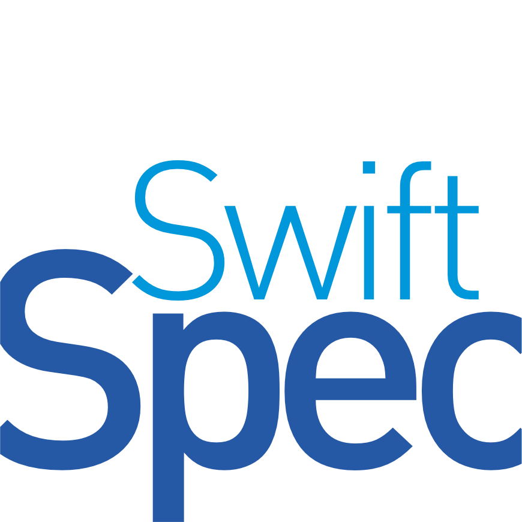

# SwiftSpec

<p align="center">
  
</p>

<h3 align="center">Rapidez que Esclarece, APIs que Impressionam</h3>

<p align="center">
  Uma ferramenta revolucionária de documentação de API para projetos Node.js e JavaScript.
  <br>
  <a href="#demonstração"><strong>Explore a demonstração »</strong></a>
  <br>
  <br>
  <a href="https://github.com/jrsnpe/swiftspec/issues">Reportar Bug</a>
  ·
  <a href="https://github.com/jrsnpe/swiftspec/issues">Solicitar Feature</a>
</p>

<p align="center">
  <a href="https://www.npmjs.com/package/swiftspec"></a>
  <a href="https://opensource.org/licenses/MIT"></a>
  <a href="https://nodejs.org/en/"></a>
  <a href="https://www.npmjs.com/package/swiftspec"></a>
  
</p>

## Índice

- [Sobre o Projeto](#sobre-o-projeto)
- [Características](#características)
- [Começando](#começando)
  - [Pré-requisitos](#pré-requisitos)
  - [Instalação](#instalação)
- [Contribuindo](#contribuindo)
- [Contato](#contato)

## Sobre o Projeto

SwiftSpec é uma ferramenta de documentação de API projetada para transformar o processo de criação e manutenção de especificações de API. Com foco na eficiência e clareza, SwiftSpec permite que desenvolvedores e equipes técnicas criem documentação de API de alta qualidade em uma fração do tempo tradicional.

## Características

- 🚀 **Geração Rápida**: Crie documentação completa em questão de segundos
- 📚 **Clareza Incomparável**: Transforme códigos complexos em documentação cristalina
- 🎨 **Design Impressionante**: APIs que não só funcionam bem, mas também impressionam visualmente
- 🔄 **Sincronização em Tempo Real**: Atualizações automáticas conforme o código muda
- 🌐 **Suporte Multi-linguagem**: Compatível com várias linguagens e frameworks
- 👥 **Colaboração Integrada**: Facilita o trabalho em equipe na documentação

## Começando

### Pré-requisitos

- Node.js (versão 14.0.0 ou superior)
- npm (normalmente vem com Node.js)

### Instalação

```bash
npm install -g swiftspec
```

## Contribuindo

SwiftSpec é um projeto de código aberto e nós adoraríamos contar com a sua ajuda para torná-lo ainda melhor! Há várias maneiras de contribuir:

### Para Desenvolvedores

1. **Código**: Implemente novas features, corrija bugs ou melhore a estrutura do código.
2. **Documentação**: Ajude a melhorar ou traduzir a documentação.
3. **Testes**: Escreva testes para aumentar a cobertura e garantir a estabilidade.
4. **Revisão**: Revise pull requests de outros contribuidores.

### Para Não-Desenvolvedores

1. **Feedback**: Use o SwiftSpec e nos conte sua experiência.
2. **Ideias**: Sugira novas features ou melhorias.
3. **Divulgação**: Compartilhe o SwiftSpec com outros desenvolvedores.
4. **Design**: Contribua com melhorias de UI/UX para a documentação gerada.

Para começar:

1. Faça um Fork do projeto
2. Crie sua Feature Branch (`git checkout -b feature/AmazingFeature`)
3. Commit suas mudanças (`git commit -m 'Add some AmazingFeature'`)
4. Push para a Branch (`git push origin feature/AmazingFeature`)
5. Abra um Pull Request

Consulte nosso [Guia de Contribuição](CONTRIBUTING.md) para mais detalhes sobre nosso processo de desenvolvimento e padrões de código.

Junte-se a nós e faça parte desta jornada para transformar a forma como documentamos APIs!

## Contato

Temos vários canais para você entrar em contato conosco:

- **Criador do Projeto**: José Reginaldo

  - GitHub: [@jrsnpe](https://github.com/jrsnpe)
  - NPM: [~jrsnpe](https://www.npmjs.com/~jrsnpe)
  - Linkedin: [/in/reginaldo](https://www.linkedin.com/in/reginaldo/)
  - Instagram: [/reginaldoneto](https://www.instagram.com/reginaldoneto/)
  - Email: jrsnpe@gmail.com

- **Equipe de Desenvolvimento**:

  - Faça Parte e tenha seu nome aqui!
  - Email: jrsnpe@gmail.com

- **Suporte**:

  - Email: jrsnpe@gmail.com

- **Repositório do Projeto**: [https://github.com/jrsnpe/swiftspec](https://github.com/jrsnpe/swiftspec)

Fique à vontade para nos contatar. Adoraríamos ouvir suas ideias, feedback ou qualquer pergunta que você possa ter!
Participe das discussões, compartilhe suas experiências e aprenda com outros usuários do SwiftSpec!
